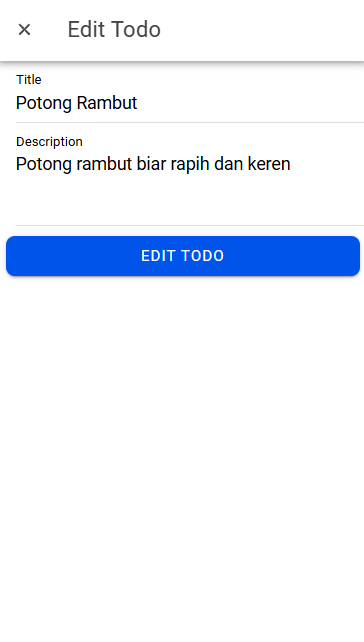

# IONIC VUE FIREBASE

## Pertemuan 10

### Penjelasan Source Code

1. Melakukan Login

```vue
<script setup lang="ts">
import { IonContent, IonPage, IonButton, IonIcon, IonText, IonLabel } from '@ionic/vue';
import { logoGoogle } from 'ionicons/icons';
import { useAuthStore } from '@/stores/auth';

const authStore = useAuthStore();

const login = async () => {
    await authStore.loginWithGoogle();
};
</script>
```

useAuthStore diimpor dari store Vue bernama auth.ts, yang menyimpan status otentikasi dan fungsi untuk proses login. Fungsi login menggunakan async untuk menangani proses asinkron login dengan Google

```typescript
export const useAuthStore = defineStore('auth', () => {
    // Variabel User
    const user = ref<User | null>(null);

    // Variabel isAuth mengembalikan true or false
    // Cek jika user sudah login atau belum
    const isAuth = computed(() => user.value !== null);

    // Sign In with Google
    const loginWithGoogle = async () => {
        try {
            await GoogleAuth.initialize({
                clientId: '985093640397-eum5h2hk1npl2250tb9io3vn6i9aa9jg.apps.googleusercontent.com',
                scopes: ['profile', 'email'],
                grantOfflineAccess: true,
            });

            const googleUser = await GoogleAuth.signIn();

            const idToken = googleUser.authentication.idToken;

            const credential = GoogleAuthProvider.credential(idToken);

            const result = await signInWithCredential(auth, credential);

            user.value = result.user;

            router.push("/home");
        } catch (error) {
            console.error("Google sign-in error:", error);
            
            const alert = await alertController.create({
                header: 'Login Gagal!',
                message: 'Terjadi kesalahan saat login dengan Google. Coba lagi.',
                buttons: ['OK'],
            });

            await alert.present();

            throw error;
        }
    };
```

Variabel user dideklarasikan sebagai ref untuk menyimpan data pengguna yang mengembalikan nilai true jika user berisi data (sudah login) dan false jika user bernilai null.

Fungsi loginWithGoogle merupakan fungsi asinkron yang menginisialisasi login Google melalui GoogleAuth.initialize, dengan mengatur clientId aplikasi.
Setelah inisialisasi, aplikasi memanggil GoogleAuth.signIn() untuk menampilkan halaman login Google kepada pengguna. Setelah pengguna berhasil login, token ID (idToken) 
diperoleh dari objek googleUser dan dikonversi menjadi kredensial dengan GoogleAuthProvider.credential(idToken). Kredensial ini digunakan oleh Firebase untuk melakukan 
autentikasi melalui signInWithCredential, dan jika berhasil, data pengguna disimpan di user.value.

Selanjutnya, pengguna diarahkan ke halaman /home melalui router.push.

2. Autentikasi Akun Login Google

```vue
const routes: Array<RouteRecordRaw> = [
  {
    path: '/',
    redirect: '/login',
  },
  {
    path: '/login',
    name: 'login',
    component: LoginPage,
    meta: {
      isAuth: false,
    },
  },
  {
    path: '/home',
    name: 'home',
    component: HomePage,
    meta: {
      isAuth: true,
    },
  },
  {
    path: '/profile',
    name: 'profile',
    component: ProfilePage,
    meta: {
      isAuth: true,
    },
  },
];

const router = createRouter({
  history: createWebHistory(import.meta.env.BASE_URL),
  routes,
});

router.beforeEach(async (to, from, next) => {
  const authStore = useAuthStore();

  if (authStore.user === null) {
    await new Promise<void>((resolve) => {
      const unsubscribe = onAuthStateChanged(auth, () => {
        resolve();
        unsubscribe();
      });
    });
  }

  if (to.path === '/login' && authStore.isAuth) {
    next('/home');
  } else if (to.meta.isAuth && !authStore.isAuth) {
    next('/login');
  } else {
    next();
  }
});

export default router;
```

Kode di atas mendefinisikan konfigurasi routing yang mengatur navigasi antar halaman dan membatasi akses berdasarkan status autentikasi pengguna.
Setiap rute memiliki properti meta dengan atribut isAuth. Rute yang memerlukan autentikasi (isAuth: true) hanya dapat diakses jika pengguna telah login, 
seperti pada halaman /home dan /profile. Router menggunakan fungsi beforeEach untuk memeriksa status autentikasi sebelum berpindah ke halaman tertentu. 
Fungsi ini mengambil authStore untuk memeriksa status autentikasi pengguna.

Jika data user dalam authStore kosong, aplikasi memeriksa status autentikasi dengan Firebase melalui onAuthStateChanged, yang memperbarui authStore 
ketika status berubah. Jika pengguna mengakses halaman /login dan telah login (isAuth bernilai true), pengguna diarahkan ke /home. Sebaliknya, jika 
pengguna mencoba mengakses halaman yang membutuhkan autentikasi tetapi belum login, mereka diarahkan ke /login.

3. Menampilkan Profil Dari Akun Google

```vue
<script setup lang="ts">
import { IonContent, IonHeader, IonPage, IonTitle, IonToolbar, IonInput, IonItem, IonList, IonLabel, IonIcon, IonButton, IonAvatar } from '@ionic/vue';
import { exit } from 'ionicons/icons';
import { computed, ref } from 'vue';
import TabsMenu from '@/components/TabsMenu.vue';
import { useAuthStore } from '@/stores/auth';

const authStore = useAuthStore();
const user = computed(() => authStore.user);

const userPhoto = ref(user.value?.photoURL || 'https://ionicframework.com/docs/img/demos/avatar.svg');

function handleImageError() {
    userPhoto.value = 'https://ionicframework.com/docs/img/demos/avatar.svg';
}
</script>
```

Variabel authStore dibuat untuk mengakses store auth, yang mengelola status autentikasi pengguna. Data Nama dan Email pengguna diambil dari variabel user yang mengacu pada store auth dan ditampilkan sebagai teks readonly.
Variabel userPhoto didefinisikan sebagai ref yang berisi URL foto profil pengguna dari user.value.photoURL

### Screenshot Aplikasi


Gambar di atas merupakan halaman Login awal yang ditampilkan ketika aplikasi dijalankan, pengguna dapat menekan tombol "SIGN IN WITH GOOGLE" untuk melakukan login menggunakan akun google.


Setelah menekan tombol "SIGN IN WITH GOOGLE", pengguna akan diarahkan untuk memilih akun Google yang akan digunakan untuk login.


Selanjutnya adalah mengonfirmasi proses login dengan menekan tombol "Continue" untuk melanjutkan proses login.


Jika proses login berhasil, pengguna akan diarahkan ke halaman Home yang pada bagian bawah menampilkan Navbar untuk menuju ke halaman Home dan halaman Profile.


Pada halaman Profile, ditampilkan data dari email pengguna berupa foto profil, nama akun, dan email akun. Di pojok kanan atas terdapat tombol yang digunakan untuk melakukan proses logout.

## Pertemuan 11

### Screenshot CRUD

1. Create ToDo


Dalam proses Create, ketika pengguna menambahkan data todo, pengguna menginputkan data title dan description. Data yang diinput dikirimkan melalui fungsi addTodo pada firestoreService. 
Fungsi ini menambahkan data baru ke Firestore yang diambil berdasarkan uid pengguna. Data yang berhasil ditambahkan akan muncul di daftar todo melalui pembaruan data lokal.

2. Read ToDo


Dalam proses Read, terdapat fungsi getTodos yang digunakan untuk mengambil daftar todo pengguna. Koleksi todo diambil berdasarkan uid pengguna, kemudian diurutkan berdasarkan updatedAt 
secara menurun. Data todo ditampilkan pada halaman utama HomePage.vue.

3. Update ToDo




Pada proses Update, pengguna dapat memperbarui isi todo melalui fungsi updateTodo. Ketika pengguna memilih untuk mengedit sebuah todo, modal input akan terbuka dengan data yang sudah ada. 
Setelah diedit, data yang diperbarui dikirimkan ke Firestore dan diperbarui. Pengguna juga dapat mengubah status todo antara active dan completed yang diolah menggunakan computed properties 
menggunakan fungsi updateStatus.

4. Delete ToDo


Untuk Delete, pengguna dapat menghapus todo melalui swipe atau tombol. Fungsi deleteTodo akan menghapus data berdasarkan id dari Firestore. Setelah operasi delete selesai, data lokal diperbarui 
untuk memastikan bahwa todo yang dihapus tidak lagi muncul dalam daftar.
